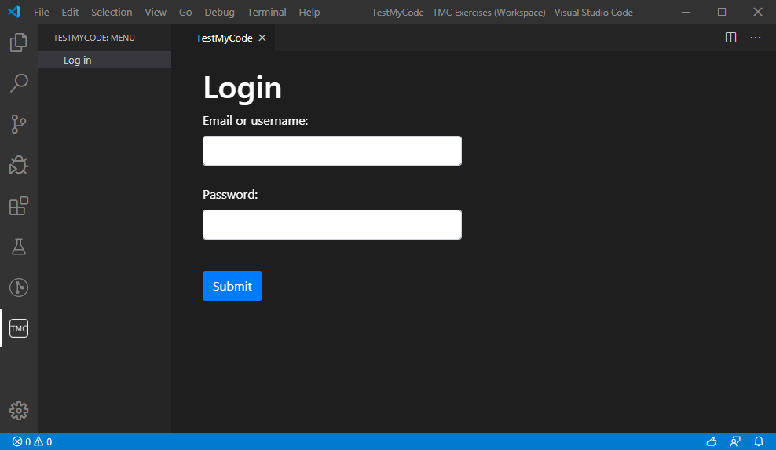

# TestMyCode for Visual Studio Code

This extension provides [TestMyCode](https://tmc.mooc.fi/) integration for Visual Studio Code.
Students of its various organizations can download, complete and return course exercises directly from the editor.

To use extension you will need
* [TestMyCode](https://tmc.mooc.fi/) account
* [Java](https://www.java.com/) runtime (for packing/unpacking and testing exercises)
* Course-specific system environment

## Getting started

1. Install this extension.
2. Select the TMC icon on the left side bar.
   * **First time initialization will take some time!** Please pay attention to the bottom bar during this time.
3. Select *Log in* from the TestMyCode menu.
4. Enter your credentials and log in.

* Now you can add courses to "My courses" list.
* By selecting a course afterwards, you may select exercises you want to download.

## Editor usage

Downloaded exercises appear on the Explorer:

### Testing a solution
When you want to test your solution, click the "TMC - Run tests". It is located in the top right corner of the screen. It is highlighted as blue in the following picture.

### Submitting a solution
If your solution passes tests, click the "TMC - Submit solutions" in the top right corner. It is highlighted as red in the following picture. 

### Resetting an exercise
If you want to reset your active exercise, you can open a dropdown menu by clicking the button highlighted as green in the following image. It is located in the top right corner. Click "TMC - Reset exercise" from the dropdown menu.

