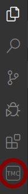
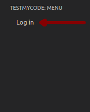
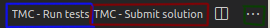

# Instructions for extension users
-----------------------------------
(logo) "Visual Studio Marketplace v1.x"

This extension is used for sending excercise solutions to TMC-server. 

## Usage

Click TMC icon on the left side bar.

Next click "Log in" that shows up.

Now you can add courses to "My courses" list.

By clicking the course, you can select the excercises you want to download.

Next click the explorer icon on the left side bar.

Now your excercises will show in the explorer.

### Testing a solution
When you want to test your solution, click the "TMC - Run tests". It is located in the top right corner of the screen. It is highlighted as blue in the following picture.

### Submitting a solution
If your solution passes tests, click the "TMC - Submit solutions" in the top right corner. It is highlighted as red in the following picture. 

### Resetting an excercise
If you want to reset your active excercice, you can open a dropdown menu by clicking the button highlighted as green in the following image. It is located in the top right corner. Click "TMC - Reset excercise" from the dropdown menu.

